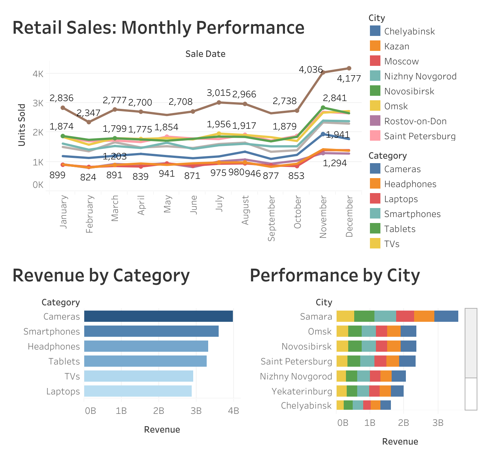

# Valeriya Kormina — Business Intelligence Portfolio

**BI Analyst** | Tableau · PostgreSQL · Python · SQL  
📍 Guangzhou, China (open to remote worldwide)  
📧 vkormina@yahoo.com · [LinkedIn](https://linkedin.com/in/valeriya-kormina) · [GitHub](https://github.com/vkormina-5)

---

## About Me

I am a Master's candidate in Informatics and Computer Engineering at RTU MIREA (Moscow), specialising in Business Intelligence systems for small and medium-sized enterprises. My thesis focuses on designing a full-cycle analytical system — from database architecture and ETL pipelines to interactive dashboards — evaluated through a Design Science Research methodology.

My background combines hands-on analytics experience (Servier Russia, pharmaceutical secondary sales reporting) with two years of working across international environments in China and Brazil. I am currently building toward a doctoral programme focused on BI adoption in emerging economies.

**Core stack:** Tableau · PostgreSQL · Python (Pandas, ETL) · SQL · Looker Studio · Git

---

## Projects

### 1. Synthetic Business Data Generator
`Python` `PostgreSQL` `ETL`

A modular data generation pipeline developed as part of my master's thesis research. Produces realistic synthetic datasets simulating SME business operations — orders, products, customers, and sales transactions — for use in BI system testing and performance benchmarking.

**What it does:**
- Generates configurable volumes of synthetic transactional data
- Loads directly into PostgreSQL via automated ETL pipeline
- Supports reproducible testing environments for BI platform evaluation

**Why it matters:** Synthetic data generation was a key methodological contribution of my thesis — enabling rigorous performance and security testing of the analytical system without exposing real business data.

📁 [View code → data-generator/](./data-generator)

---

### 2. SME Sales Performance Dashboard *(in progress)*
`Tableau` `PostgreSQL` `Python` `SQL`

End-to-end BI project analysing sales performance for a small retail business. Built on the Brazilian e-commerce dataset (Olist, 100k+ real orders from Brazilian SMEs).

**Approach:**
- ETL pipeline in Python (Pandas) — cleaning, joining, loading to PostgreSQL
- SQL queries for KPI calculation: revenue by category, seller performance, delivery SLA
- Tableau dashboard with three views: Executive Overview, Seller Analysis, Customer Satisfaction

**Status:** In active development. Dashboard link will be published on Tableau Public upon completion.

📁 🔗 [Live Dashboard on Tableau Public](https://public.tableau.com/app/profile/valerie.kormina/viz/RetailSalesMonthlyPerformance/Dashboard1)

---

### 3. BI Platform Comparative Analysis *(thesis extract)*
`Research` `SQL` `PostgreSQL`

Multi-criteria analysis of three BI platforms (Power BI, Tableau, Looker Studio) conducted as part of my master's thesis. Evaluated platforms against cost, scalability, ease of integration, and suitability for resource-constrained SME environments.

**Methodology:** Design Science Research (DSR) — structured evaluation cycles with quantitative benchmarking.

**Deliverable:** Structured decision framework for SMEs choosing a BI platform with limited IT resources.

📄 Summary document coming soon

---

## Tech Stack

| Category | Tools |
|---|---|
| **Visualisation & BI** | Tableau, Looker Studio |
| **Databases** | PostgreSQL, SQL |
| **ETL & Scripting** | Python (Pandas), ETL pipelines |
| **Dev Tools** | Git, GitHub, DBeaver |
| **Office & Docs** | Excel, Markdown |

---

## Certifications

- 🎓 Google Data Analytics Professional Certificate (Coursera)
- 📊 TESOL Certificate — 250 hours (2025)
- 🌐 ILAC English Certificate — C1 Level

---

## Research Interests

- Business Intelligence adoption in SMEs
- Lightweight BI architectures for resource-constrained environments
- Design Science Research methodology in Information Systems
- Empirical validation of BI solutions in emerging economies (Brazil, SE Asia)

---

## Background

| | |
|---|---|
| **Languages** | Russian (native) · English (C1) · Chinese (intermediate) · Portuguese (basic) |
| **International** | 3 years in China · 4 months in Brazil (Maceió) |
| **Domain experience** | Pharmaceutical analytics (Servier Russia) · ESL education (China) |

---

*Portfolio actively updated. Next additions: Tableau Public dashboard (Olist dataset), SQL query library, case study PDF.*
